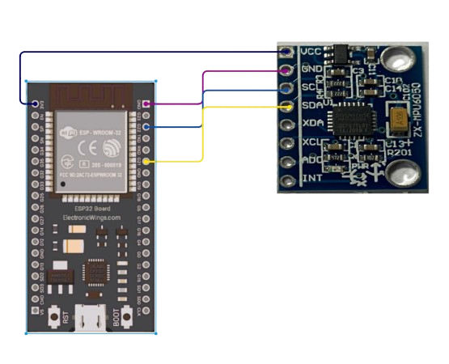

# BFree

**BFree** is an innovative wearable device designed to help people manage and eliminate repetitive body-focused behaviors (BFRB), such as nail biting, hair pulling, and skin picking. This smart device combines technology with personalized feedback to provide real-time support for breaking harmful habits. Through gentle reminders and a user-friendly interface, BFree empowers you to regain control and develop healthier behaviors. Whether you're at home, at work, or on the go, BFree is there to guide you on your journey to becoming more confident and stress-free.

---

## Technologies

### Mobile app

- Frontend: React native
- Backend: Node.js with express

### ESP-32

- ESP-32 with WI-FI connection
- Accelerometer

Embedded scheme:

### Machine learning model

- Taught to recognize characteristic BFRB movements
- Uses Random Forest algorithm
- Outputs with an accuracy of 71%
- Dataset for training by Bhorda: [repo link](https://github.com/Bhorda/BFRBAnticipationDataset)

---

## How it works

The ESP exports data to a Machine learning model, which is taught to recognize characteristic movements.

The machine learning model sends signals to the Node.js server if it detects an "incident".

The Node.js server communicates with a database, which saves the incidents and a React mobile app, which tracks tendencies and gives reports and statistics.

---

### Sources

Machine learning model: Benjamin Searle, Dimitris Spathis, Marios Constantinides, Daniele Quercia, Cecilia Mascolo. 2021. "Anticipatory Detection of Compulsive Body-focused Repetitive Behaviors with Wearables." In Proceedings of ACM International Conference on Mobile Human-Computer Interaction (MobileHCI 2021)
